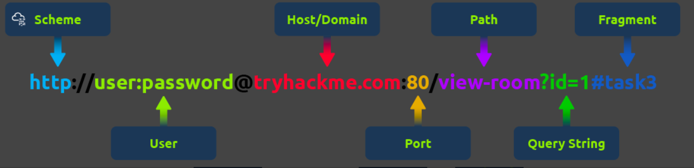
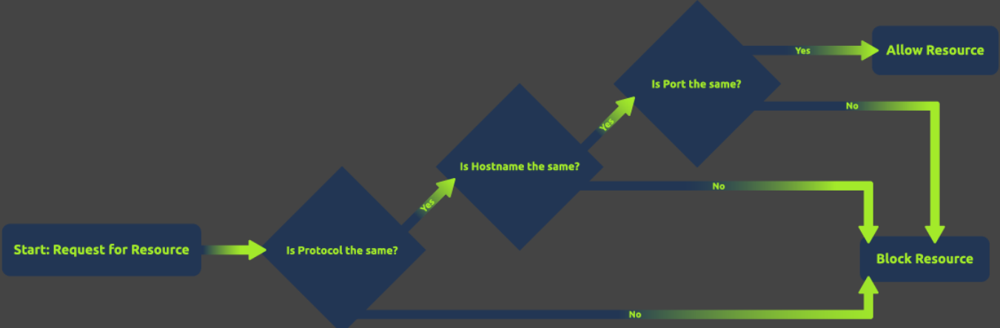
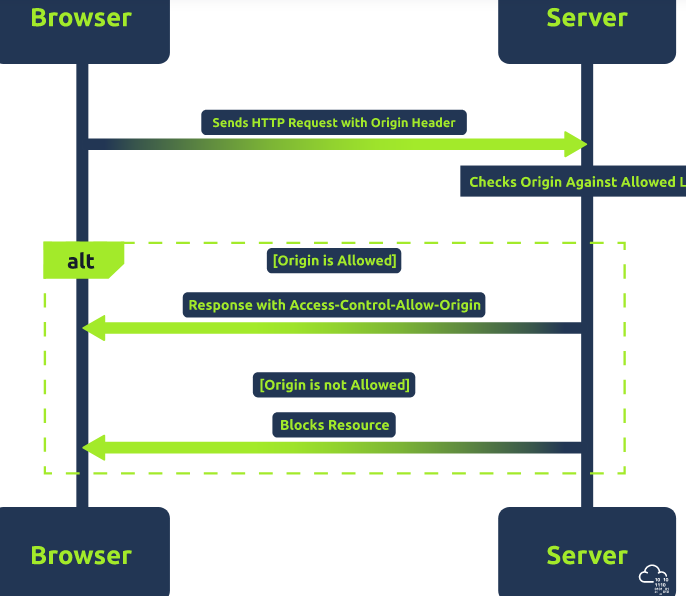
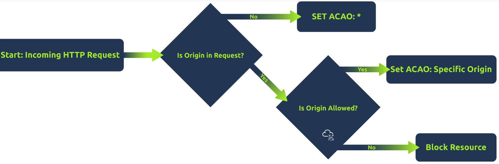
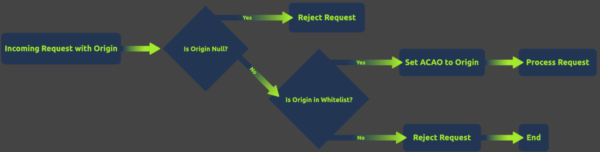

***Cross-Origin Resource Sharing, also known as CORS, is a mechanism that allows web applications to request resources from different domains securely. This is crucial in web security as it prevents malicious scripts on one page from obtaining access to sensitive data on another web page through the browser.***

***Same-origin policy, also known as SOP, is a security measure restricting web pages from interacting with resources from different origins. An origin is defined by the scheme (protocol), hostname (domain), and URL port.***

### Same-Origin Policy

Same-origin policy or SOP is a policy that instructs how web browsers interact between web pages. According to this policy, a script on one web page can access data on another only if both pages share the same origin. This "origin" is identified by combining the URI scheme, hostname, and port number. The image below shows what a URL looks like with all its features (it does not use all features in every request).

This policy is designed to prevent a malicious script on one page from accessing sensitive data on another web page through the browser.

Examples of SOP

- Same domain, different port: A script from https://test.com:80 can access data from https://test.com:80/about, as both share the same protocol, domain, and port. However, it cannot access data from https://test.com:8080 due to a different port.
- HTTP/HTTPS interaction: A script running on http://test.com (non-secure HTTP) is not allowed to access resources on https://test.com (secure HTTPS), even though they share the same domain because the protocols are different.

#### Common Misconceptions

- Scope of SOP: It's commonly misunderstood that SOP only applies to scripts. In reality, it applies to all web page aspects,including embedded images, stylesheets, and frames, restricting how these resources interact based on their origins.
- SOP Restricts All Cross-Origin Interactions: Another misconception is that SOP completely prevents all cross-origin interactions.While SOP does restrict specific interactions, modern web applications often leverage various techniques (like CORS, postMessage,etc.) to enable safe and controlled cross-origin communications.
- Same Domain Implies Same Origin: People often think that if two URLs share the same domain, they are of the same origin. However,SOP also considers protocol and port, so two URLs with the same domain but different protocols or ports are considered different origins.

### Cross-Origin Resource Sharing

***Cross-Origin Resource Sharing (CORS) is a mechanism defined by HTTP headers that allows servers to specify how resources can be requested from different origins. While the Same-Origin Policy (SOP) restricts web pages by default to making requests to different domain, CORS enables servers to declare exceptions to this policy, allowing web pages to request resources from other domains under controlled conditions.***

CORS operates through a set of HTTP headers that the server sends as part of its response to a browser. These headers inform the browser about the server's CORS policy, such as which origins are allowed to access the resources, which HTTP methods are permitted, and whether credentials can be included with the requests. ***It's important to note that the server does not block or allow a request based on CORS; instead, it processes the request and includes CORS headers in the response. The browser then interprets these headers and enforces the CORS policy by granting or denying the web page's JavaScript access to the response based on the specified rules.***

#### Different HTTP Headers Involved in CORS

- Access-Control-Allow-Origin: This header specifies which domains are allowed to access the resources. For example,Access-Control-Allow-Origin: example.com allows only requests from example.com.
- Access-Control-Allow-Methods: Specifies the HTTP methods (GET, POST, etc.) that can be used during the request.
- Access-Control-Allow-Headers: Indicates which HTTP headers can be used during the actual request.
- Access-Control-Max-Age: Defines how long the results of a preflight request can be cached.
- Access-Control-Allow-Credentials: This header instructs the browser whether to expose the response to the frontend JavaScript code when credentials like cookies, HTTP authentication, or client-side SSL certificates are sent with the request. - IfAccess-Control-Allow-Credentials is set to true, it allows the browser to access the response from the server when credentials are included in the request. It's important to note that when this header is used, Access-Control-Allow-Origin cannot be set to * andmust specify an explicit domain to maintain security.

#### Common Scenarios Where CORS is Applied

- APIs and Web Services: When a web application from one domain needs to access an API hosted on a different domain, CORS enables this interaction. For instance, a frontend application at example-client.com might need to fetch data from example-api.com.
- Content Delivery Networks (CDNs): Many websites use CDNs to load libraries like jQuery or fonts. CORS enables these resources to be securely shared across different domains.
- Web Fonts: For web fonts to be used across different domains, CORS headers must be set, allowing websites to load fonts from a centralized location.
- Third-Party Plugins/Widgets: Enabling features like social media buttons or chatbots from external sources on a website.
- Multi-Domain User Authentication: Services that offer single sign-on (SSO) or use tokens (like OAuth) to authenticate users across multiple domains rely on CORS to exchange authentication data securely.

### Simple Requests vs. Preflight Requests

There are two primary types of requests in CORS: simple requests and preflight requests.

- Simple Requests: These requests meet certain criteria set by CORS that make them "simple". They are treated similarly to same-origin requests, with some restrictions. A request is considered simple if it uses the GET, HEAD, or POST method, and the POST request's Content-Type header is one of application/x-www-form-urlencoded, multipart/form-data, or text/plain. Additionally, the request should not include custom headers that aren't CORS-safe listed. Simple requests are sent directly to the server with the Origin header, and the response is subject to CORS policy enforcement based on the Access-Control-Allow-Origin header. Importantly, cookies and HTTP authentication data are included in simple requests if the site has previously set such credentials, even without the Access-Control-Allow-Credentials header being true.
- Preflight Requests: These are CORS requests that the browser "preflights" with an OPTIONS request before sending the actual request to ensure that the server is willing to accept the request based on its CORS policy. Preflight is triggered when the request does not qualify as a "simple request", such as when using HTTP methods other than GET, HEAD, or POST, or when POST requests are made with another Content-Type other than the allowed values for simple requests, or when custom headers are included. The preflight OPTIONS request includes headers like Access-Control-Request-Method and Access-Control-Request-Headers, indicating the method and custom headers of the actual request. The server must respond with appropriate CORS headers, such as Access-Control-Allow-Methods, Access-Control-Allow-Headers, and Access-Control-Allow-Origin to indicate that the actual request is permitted. If the preflight succeeds, the browser will send the actual request with credentials included if Access-Control-Allow-Credentials is set to true.

#### Process of a CORS Request

- The browser first sends an HTTP request to the server.
- The server then checks the Origin header against its list of allowed origins.
- If the origin is allowed, the server responds with the appropriate Access-Control-Allow-Origin header.
- The browser will block the cross-origin request if the origin is not allowed.

### Access-Control-Allow-Origin Header

The Access-Control-Allow-Origin or ACAO header is a crucial component of the Cross-Origin Resource Sharing (CORS) policy. It is used by servers to indicate whether the resources on a website can be accessed by a web page from a different origin. This header is part of the HTTP response provided by the server.

When a browser makes a cross-origin request, it includes the origin of the requesting site in the HTTP request. The server then checks this origin against its CORS policy. If the origin is permitted, the server includes the Access-Control-Allow-Origin header in the response, specifying either the allowed origin or a wildcard (*), which means any origin is allowed.

ACAO Configurations

1) Single Origin:
        - Configuration: Access-Control-Allow-Origin: https://example.com
        - Implication: Only requests originating from https://example.com are allowed. This is a secure configuration, as it restricts access to a known, trusted origin.
2) Multiple Origins:
        - Configuration: Dynamically set based on a list of allowed origins.
        - Implication: Allows requests from a specific set of origins. While this is more flexible than a single origin, it requires careful management to ensure that only trusted origins are included.
3) Wildcard Origin:
        - Configuration: Access-Control-Allow-Origin: *
        - Implication: Permits requests from any origin. This is the least secure configuration and should be used cautiously. It's appropriate for publicly accessible resources that don't contain sensitive information.
4) With Credentials:
        - Configuration: Access-Control-Allow-Origin set to a specific origin (wildcards not allowed), along with Access-Control-Allow-Credentials: true
        - Implication: Allows sending of credentials, such as cookies and HTTP authentication data, to be included in cross-origin requests. However, it's important to note that browsers will send cookies and authentication data without the Access-Control-Allow-Credentials header for simple requests like some GET and POST requests. For preflight requests that use methods other than GET/POST or custom headers, the Access-Control-Allow-Credentials header must be true for the browser to send credentials.

### Common CORS Misconfigurations

CORS misconfigurations can create significant security vulnerabilities in web applications. Understanding these common misconfigurations is crucial for both developers and security professionals. We will explore several typical misconfigurations and how they can be exploited.

1) Null Origin Misconfiguration: This occurs when a server accepts requests from the "null" origin. This can happen in scenarios where the origin of the request is not a standard browser environment, like from a file (file://) or a data URL. An attacker could craft a phishing email with a link to a malicious HTML file. When the victim opens the file, it can send requests to the vulnerable server, which incorrectly accepts these as coming from a 'null' origin. Servers should be configured to explicitly validate and not trust the 'null' origin unless necessary and understood.
2) Bad Regex in Origin Checking: Improperly configured regular expressions in origin checking can lead to accepting requests from unintended origins. For example, a regex like /example.com$/ would mistakenly allow badexample.com. An attacker could register a domain that matches the flawed regex and create a malicious site to send requests to the target server. Another example of lousy regex could be related to subdomains. For example, if domains starting with example.com is allowed, an attacker could use example.com.attacker123.com. The application should ensure that regex patterns used for validating origins are thoroughly tested and specific enough to exclude unintended matches.
3) Trusting Arbitrary Supplied Origin: Some servers are configured to echo back the Origin header value in the Access-Control-Allow-Origin response header, effectively allowing any origin. An attacker can craft a custom HTTP request with a controlled origin. Since the server echoes this origin, the attacker's site can bypass the SOP restrictions. Instead of echoing back origins, maintain an allowlist of allowed origins and validate against it.

